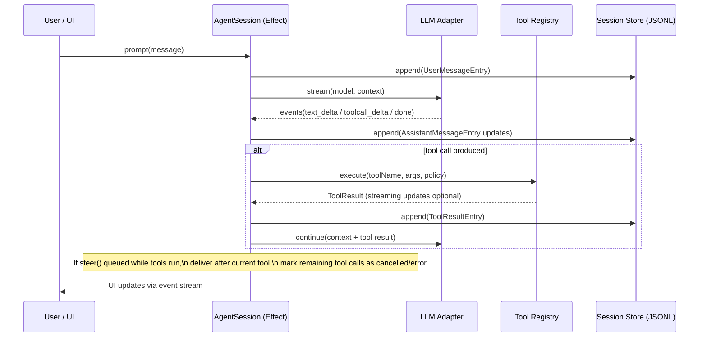

# spec.md — pi-bun-effect

## Overview

pi-bun-effect is a Bun-first agent platform written in TypeScript using Effect-TS. It preserves pi-mono behavioral contracts (sessions, compaction, RPC, extensions/packages/skills/prompt templates) while adopting a stronger "capability + mediation" execution model inspired by pi_agent_rust.

Primary execution modes:

- Interactive TUI
- Print/JSON
- RPC over stdio
- SDK embedding

Key storage:

- JSONL v3 sessions (source of truth)
- Optional SQLite index cache (derived) via bun:sqlite

## Architecture

### High-level components

```mermaid
flowchart TB
  subgraph UI[User Interfaces]
    TUI["Interactive TUI (terminal)"]
    CLI["CLI (print/json)"]
    RPC["RPC (stdio JSONL)"]
    WEB["Web UI (optional)"]
    SLACK["Slack bot (optional)"]
  end

  subgraph CORE[Core Runtime (Effect)]
    AGENT["Agent Runtime\n(turn loop + queues + compaction)"]
    LLM["Unified LLM Adapter\n(stream + tool calls + usage/cost)"]
    TOOLS["Tool Registry\n(read/write/edit/bash/grep/find/ls/...)"]
    SESS["Session Store\n(JSONL v3)"]
    IDX["Index Cache\n(SQLite)"]
    PKG["Packages/Resources\n(packages/skills/prompts/themes)"]
    EXT["Extensions Runtime\n(capabilities + hooks + UI prompts)"]
    SEARCH["Code Search\n(indexer + fuzzy + ranking)"]
    OBS["Observability\n(logs + tracing + metrics hooks)"]
    POLICY["Policy Engine\n(capability grants + exec mediation)"]
  end

  subgraph OPS[Operational Integrations]
    PODS["vLLM Pods Manager\n(SSH + model lifecycle)"]
    ART["Artifacts Server\n(Bun.serve + WS)"]
  end

  UI --> AGENT
  AGENT --> LLM
  AGENT --> TOOLS
  AGENT --> SESS
  SESS --> IDX
  PKG --> EXT
  EXT --> AGENT
  SEARCH --> TOOLS
  WEB --> ART
  PODS --> LLM
  POLICY --> TOOLS
  POLICY --> EXT
  OBS --> AGENT
  OBS --> TOOLS
  OBS --> LLM
```

### Agent turn loop and message queues



## Module breakdown

Proposed monorepo packages (names illustrative):

- packages/core: domain types (messages/events/errors), Effect layers, shared utils
- packages/llm: provider adapters, model registry, streaming + partial tool-call JSON assembly
- packages/agent: Agent runtime (queues, compaction triggers, retry, cancellation)
- packages/session: JSONL v3 persistence, migration, tree navigation, export
- packages/index: SQLite cache + query APIs (session metadata, frecency, search indices)
- packages/tools: built-in tools + sandboxed exec runner
- packages/extensions: extension API, event interception, UI prompts bridging, package loader hooks
- packages/search: file indexer, fuzzy matcher, grep integration, ranking
- packages/cli: CLI entrypoint (Effect CLI), mode dispatch
- packages/tui: TUI framework (differential renderer or adapter)
- packages/web-ui (optional): browser components / artifacts viewer
- packages/slack-bot (optional): Slack ingestion + per-channel session mapping
- packages/pods: vLLM pods manager (SSH orchestration)

## Data models

### Session JSONL v3 (source of truth)

Session entries are append-only JSON objects:

- first line: session header (version=3)
- subsequent lines: entries with {type, id, parentId, timestamp, ...}

Messages are AgentMessage union:

- user / assistant / toolResult (+ extended roles like compactionSummary, branchSummary, custom)

### LLM events

Streaming returns an async stream of:

- start
- text_start/text_delta/text_end
- thinking_start/thinking_delta/thinking_end (provider dependent)
- toolcall_start/toolcall_delta/toolcall_end
- done (stop reason)
- error

## APIs

### CLI

Commands (sketch):

- pi [interactive default]
- pi -p "prompt" (print mode)
- pi --mode json (emit JSONL events)
- pi --mode rpc (stdio protocol)
- pi --continue / --resume
- pi install/remove/list/update (packages)
- pi pods ... (vLLM deployments)
- pi export [in] [out] (HTML export)

### RPC (stdio JSONL)

Implements pi-mono RPC command set:

- prompt/steer/follow_up/abort
- get_state/get_messages
- set_model/cycle_model/get_available_models
- set_thinking_level/cycle_thinking_level
- set_steering_mode/set_follow_up_mode
- compact/set_auto_compaction
- set_auto_retry/abort_retry
- bash (tool execution) and session ops (new_session, switch, fork, tree navigation)

### Unified LLM adapter

Interface (Effect style):

- LlmModelId = { provider, modelId, apiVariant? }
- stream(model, context, options): Stream<Effect, LlmError, LlmEvent>
- complete(model, context, options): Effect<..., LlmError, AssistantMessage>

Responsibilities:

- Provider configuration (baseUrl, apiKey, OAuth tokens)
- Automatic model discovery + catalog
- Token + cost tracking in usage
- Partial JSON tool-call assembly
- AbortSignal / cancellation bridge

### TUI / Web UI / Slack surfaces

- TUI subscribes to AgentSession event stream and renders:
  - message list
  - tool calls with progress
  - editor with @file fuzzy search and /command autocomplete
- Web UI reuses AgentSession via a thin transport:
  - local (in-browser) or via Bun.serve backend proxy
- Slack bot:
  - maps channels/DMs to session directories
  - stores log + attachments
  - uses same AgentSession + tools with stricter sandbox defaults

### vLLM pods manager integration

- Stores pod definitions (provider + ssh command + models path + vLLM version)
- Setup:
  - validate Ubuntu version
  - install + configure vLLM
  - configure API auth and OpenAI-compatible endpoints
- Model lifecycle:
  - start/stop/list/logs
  - set context window + GPU memory allocation presets
  - tool-calling parser presets per known model families
- Exposes baseUrl + apiKey for the LLM adapter to treat pods as OpenAI-compatible endpoints

## Concurrency and Effect patterns

- Each AgentSession is an Effect program with:
  - a single “agent fiber” controlling the turn loop
  - bounded queues for steer/followUp
  - a pub/sub hub for UI events
- Tools execute in supervised fibers with:
  - timeouts
  - cancellation propagation
  - structured resource scopes
- CPU-heavy tasks (fuzzy scoring, indexing) run in:
  - Bun workers OR Effect worker pool abstraction
  - with backpressure and time budgets for UI responsiveness

## Error handling

- Use typed error channels (Effect) with error taxonomy:
  - InvalidRequest (schema/validation)
  - Denied (policy/capability)
  - Timeout / Aborted
  - IO (fs/network)
  - ProviderError (LLM API)
  - Internal (bug)

- All errors map to:
  - user-friendly UI notifications
  - structured logs with redaction
  - session entries when appropriate (toolResult isError=true)

## Security model

Default posture:

- Capabilities are explicit per extension/tool route:
  - tool: read/write/edit/bash/grep/find/ls
  - exec: spawn processes (mediated)
  - http: outbound requests (allowlist/denylist)
  - session: session read/write
  - ui: prompts/overlays
  - events: scheduling/cron-like
- Two-stage exec guard:
  1. capability check: can this caller run exec at all
  2. command mediation: classify command patterns (rm -rf, disk writes, reverse shell patterns) and block by default
- Trust lifecycle for extensions:
  - pending -> acknowledged -> trusted -> quarantined/killed
  - changes recorded with operator provenance

Sandboxing options (open decision):

- in-process (fast, least isolation)
- Bun worker isolation (medium)
- process isolation (stronger)
- WASM tier for high-risk extensions

## Observability

- Structured logging with correlation IDs:
  - sessionId, entryId, toolCallId, extensionId
- Tracing spans:
  - llm.turn, tool.exec, fs.read/write, rpc.request, slack.event
- Metrics hooks:
  - p50/p95 latencies for LLM stream, tool exec, search queries
  - queue depth gauges for steer/followUp/event buses

## Performance considerations

- IO:
  - JSONL appends buffered, fsync policy configurable
  - SQLite indices used for fast search without scanning full JSONL
- Search:
  - incremental file indexing with git status + frecency
  - rank fusion: fuzzy score + frecency + git modified/staged boost
  - time budgets for UI operations (e.g., 150ms ceiling per search call)
- Networking:
  - streaming SSE parsing optimized for minimal allocations
  - provider adapters share a common HTTP client

## Code-search improvements inspired by fff.nvim

Implement a dedicated “SearchService” that supports:

- persistent file index with access frequency (“frecency") and git status
- typo-resistant fuzzy matching with fast lookup
- cross-mode suggestions: if file search fails, suggest content hits (grep) and vice versa
- multiline paste normalization for pasting paths/snippets

UX:

- Editor @file picker uses SearchService with sub-15ms p95 target
- /grep provides modes: plain/regex/fuzzy (fuzzy optional)
- result previews include:
  - file excerpt around match
  - git status markers
  - quick actions: open, diff, copy path, attach to prompt

## Third-party libraries and Bun-native alternatives

Selection principles:

- Prefer Bun built-ins (Bun.serve, bun:sqlite, bun test) where stable
- Prefer Effect platform abstractions where they do not force Node polyfills
- Avoid native addons unless strictly necessary

Candidates (shortlist):

- CLI: @effect/cli
- Schema: @effect/schema or zod (decision)
- HTTP Server: Bun.serve (native)
- SQLite: bun:sqlite (native) with lightweight query layer
- SSH: spawn ssh (Bun.spawn) vs pure TS ssh client (decision)
- Slack: avoid Bolt if Bun issues persist; use Slack Web API + Socket Mode over websockets (decision)
